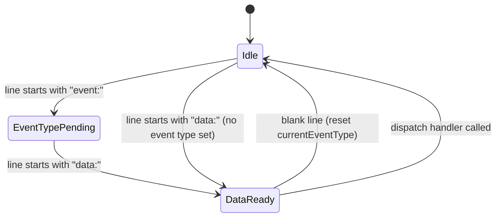

# Design Document: AI Assistant Streaming

## Overview

This document covers the minimal changes required to complete the SSE streaming integration in `AIAssistantChat.tsx` and add a backend health indicator to the chat header. The backend already emits correctly structured named SSE events. The two components that consume other AI endpoints (`AgentStatusPanel`, `AgentAlertFeed`) are already fully implemented and require no changes.

### Scope of Changes

| Component | Change |
|---|---|
| `AIAssistantChat.tsx` | Fix SSE parser to handle named events; add health indicator in header |
| `AgentStatusPanel.tsx` | No changes — already correct |
| `AgentAlertFeed.tsx` | No changes — already correct |
| Backend | No changes — already emits correct SSE format |

---

## Architecture

The SSE stream from `POST /api/v1/ai/chat` follows the standard SSE wire format with named events:

```
event: metadata\n
data: {"model":"llama3","rag_chunks_used":3,"client_id":null}\n
\n
event: token\n
data: {"token":"Hello","done":false}\n
\n
event: token\n
data: {"token":" world","done":false}\n
\n
event: done\n
data: {"token":"","done":true,"total_tokens":42,"rag_chunks_used":3}\n
\n
```

The current parser only checks `line.startsWith('data:')` and ignores `event:` lines entirely. This means:
- `metadata` events are parsed as if they were token events — `rag_chunks_used` is read from the data but only because the field happens to exist; the event type is never checked
- `error` events are never distinguished from token events
- `done` detection relies on `data.done === true` rather than the event type, which happens to work but is fragile

The fix is a two-line state machine: track `currentEventType` across lines, use it when a `data:` line arrives, clear it on blank lines.



The health indicator is a self-contained fetch + interval inside `AIAssistantChat`, reusing the same `/api/v1/ai/rag-status` endpoint that `AgentStatusPanel` already polls. No shared state or context is needed — both components poll independently.

---

## Components and Interfaces

### SSE Parser State (within `sendMessage`)

The parser runs inside the existing `while (true)` reader loop. The only new state is a single variable:

```typescript
let currentEventType: string | null = null
```

Line processing logic (replaces the existing `for (const line of lines)` block):

```typescript
for (const line of lines) {
  if (line.startsWith('event:')) {
    currentEventType = line.slice(6).trim()
    continue
  }

  if (line === '') {
    currentEventType = null
    continue
  }

  if (line.startsWith('data:')) {
    const dataStr = line.slice(5).trim()
    if (!dataStr) continue
    try {
      const data = JSON.parse(dataStr)
      dispatchSseEvent(currentEventType, data)
    } catch {
      // skip malformed JSON
    }
    currentEventType = null
  }
}
```

### `dispatchSseEvent` (pure function, extracted for testability)

Extracting the dispatch logic into a pure function makes it directly testable with fast-check:

```typescript
type SseEventType = 'metadata' | 'token' | 'done' | 'error' | null

interface SseDispatchResult {
  tokenDelta?: string       // text to append to fullContent
  ragChunks?: number        // rag_chunks_used to store
  isDone?: boolean          // true when stream is complete
  errorText?: string        // error message to display
}

function dispatchSseEvent(
  eventType: SseEventType,
  data: Record<string, unknown>
): SseDispatchResult {
  switch (eventType) {
    case 'metadata':
      return { ragChunks: (data.rag_chunks_used as number) ?? 0 }
    case 'token':
      if (data.done) return { isDone: true, ragChunks: (data.rag_chunks_used as number) ?? 0 }
      return { tokenDelta: (data.token as string) ?? '' }
    case 'done':
      return { isDone: true, ragChunks: (data.rag_chunks_used as number) ?? 0 }
    case 'error':
      return { errorText: (data.error as string) ?? 'Unknown error' }
    default:
      // Backward-compat: unnamed data lines treated as token events
      if (data.token !== undefined) return { tokenDelta: data.token as string }
      if (data.done) return { isDone: true }
      if (data.error) return { errorText: data.error as string }
      return {}
  }
}
```

### Health Indicator State (within `AIAssistantChat`)

```typescript
type HealthStatus = 'checking' | 'online' | 'offline'

const [healthStatus, setHealthStatus] = useState<HealthStatus>('checking')
```

Fetch logic (runs on mount + every 60s via `setInterval`):

```typescript
const checkHealth = useCallback(async () => {
  try {
    const res = await fetch(`${API_BASE}/api/v1/ai/rag-status`, {
      headers: { Authorization: `Bearer ${getToken()}` },
    })
    if (res.ok) {
      const data = await res.json()
      setHealthStatus(data.ollama?.connected ? 'online' : 'offline')
    } else {
      setHealthStatus('offline')
    }
  } catch {
    setHealthStatus('offline')
  }
}, [])

useEffect(() => {
  checkHealth()
  const id = setInterval(checkHealth, 60_000)
  return () => clearInterval(id)
}, [checkHealth])
```

### Health Indicator UI (in chat header)

Placed to the right of the "HiTech AI" title, left of the RAG toggle:

```tsx
const healthConfig = {
  checking: { dot: 'bg-slate-500', label: 'Checking…' },
  online:   { dot: 'bg-green-400', label: 'Ollama online' },
  offline:  { dot: 'bg-red-400',   label: 'Ollama offline' },
}

<div className="flex items-center gap-1.5">
  <div className={`w-1.5 h-1.5 rounded-full ${healthConfig[healthStatus].dot}`} />
  <span className="text-xs text-slate-400">{healthConfig[healthStatus].label}</span>
</div>
```

---

## Data Models

### SSE Wire Format (backend → frontend)

```typescript
// event: metadata
interface MetadataPayload {
  model: string
  rag_chunks_used: number
  client_id: string | null
}

// event: token
interface TokenPayload {
  token: string
  done: false
}

// event: done
interface DonePayload {
  token: ''
  done: true
  total_tokens: number
  rag_chunks_used: number
}

// event: error
interface ErrorPayload {
  error: string
}
```

### RAG Status Response (GET /api/v1/ai/rag-status)

```typescript
interface RagStatusResponse {
  ollama: { connected: boolean; model?: string }
  milvus: { connected: boolean; collections?: number }
}
```

### ChatMessage (existing, unchanged)

```typescript
interface ChatMessage {
  role: 'user' | 'assistant'
  content: string
  ragChunksUsed?: number   // displayed as "N document chunk(s) referenced"
  isStreaming?: boolean
  error?: boolean
}
```

---

## Correctness Properties

*A property is a characteristic or behavior that should hold true across all valid executions of a system — essentially, a formal statement about what the system should do. Properties serve as the bridge between human-readable specifications and machine-verifiable correctness guarantees.*

The SSE parser and dispatch function are pure functions with clear input/output behavior, making them well-suited for property-based testing with [fast-check](https://github.com/dubzzz/fast-check). The health indicator and UI state transitions are tested with example-based tests.

### Property 1: Event type is captured from `event:` lines

*For any* string value used as an SSE event type, when the parser processes a line of the form `event: <value>`, the stored `currentEventType` SHALL equal the trimmed value.

**Validates: Requirements 1.1**

### Property 2: Data dispatch clears event type

*For any* named event type and any valid JSON data payload, after the parser processes the `data:` line, the `currentEventType` SHALL be null (cleared).

**Validates: Requirements 1.2**

### Property 3: Unnamed data lines use default token logic

*For any* JSON payload containing a `token` field but no preceding `event:` line, the parser SHALL return a `tokenDelta` result (backward-compatible path).

**Validates: Requirements 1.3**

### Property 4: Blank lines reset event type

*For any* event type that has been set, processing a blank line SHALL result in `currentEventType` being null.

**Validates: Requirements 1.4**

### Property 5: Metadata rag_chunks_used is captured

*For any* non-negative integer `N`, when a `metadata` event is dispatched with `rag_chunks_used: N`, the result SHALL contain `ragChunks === N`.

**Validates: Requirements 2.1**

### Property 6: RAG chunk count display format

*For any* positive integer `N`, the rendered annotation string SHALL equal `"N document chunk(s) referenced"` (singular for N=1, plural otherwise).

**Validates: Requirements 2.3**

### Property 7: Error event text is preserved

*For any* non-empty string used as an error message, when an `error` event is dispatched with `data.error = <message>`, the result SHALL contain `errorText === <message>`.

**Validates: Requirements 4.1**

### Property 8: HTTP error message contains status code

*For any* HTTP status code in the range 400–599, the error message displayed SHALL contain that status code as a decimal string.

**Validates: Requirements 4.3**

### Property 9: Controls enabled when not streaming

*For any* component state where `isStreaming` is false, the textarea and send button SHALL not have the `disabled` attribute.

**Validates: Requirements 7.3**

### Property 10: Stop button shown when streaming

*For any* component state where `isStreaming` is true, the stop button SHALL be present in the DOM and the send button SHALL not be present.

**Validates: Requirements 7.4**

---

## Error Handling

| Scenario | Handling |
|---|---|
| `fetch` throws `TypeError` (network down) | Catch in `catch (err)` block; display "Failed to connect…" message; re-enable input |
| HTTP status ≠ 200 | `throw new Error(\`HTTP ${response.status}\`)` caught by same block; display "HTTP N" message |
| SSE `error` event received | `dispatchSseEvent` returns `errorText`; replace streaming bubble with error-styled message |
| `AbortError` from stop button | Caught separately (`err.name === 'AbortError'`); mark partial message complete, no error style |
| Malformed JSON in `data:` line | `try/catch` around `JSON.parse`; skip the line silently |
| `/api/v1/ai/rag-status` fails | `catch` sets `healthStatus = 'offline'`; no crash |
| Previous stream active on new send | `abortRef.current?.abort()` called before new `AbortController` is created |

---

## Testing Strategy

### Unit / Example-Based Tests

Use **Vitest** + **React Testing Library** (to be added as dev dependencies).

- Mount `AIAssistantChat`, mock `fetch`, verify health indicator states (checking → online/offline)
- Verify RAG toggle off suppresses chunk annotation
- Verify stop button aborts fetch and marks message complete without error style
- Verify network error and HTTP error produce correct error bubble text
- Verify `AgentStatusPanel` renders green/red dots based on mocked `/rag-status` response
- Verify `AgentAlertFeed` renders events, empty state, filter tabs, mark-read interactions

### Property-Based Tests

Use **fast-check** (to be added as dev dependency: `npm install -D fast-check vitest`).

The `dispatchSseEvent` pure function and the SSE line parser are tested with property-based tests. Each test runs a minimum of **100 iterations**.

Tag format: `// Feature: ai-assistant-streaming, Property N: <property text>`

**Properties 1–4** (SSE parser state machine) — test the `currentEventType` tracking logic directly by feeding sequences of lines and asserting state transitions.

**Properties 5–8** (`dispatchSseEvent` pure function) — generate random inputs (integers, strings, status codes) and assert output shape.

**Properties 9–10** (UI state) — use React Testing Library with generated `isStreaming` state values to assert DOM attribute presence.

### No Backend Tests Required

The backend SSE emission is already correct and tested separately. No changes to backend code means no new backend tests.
