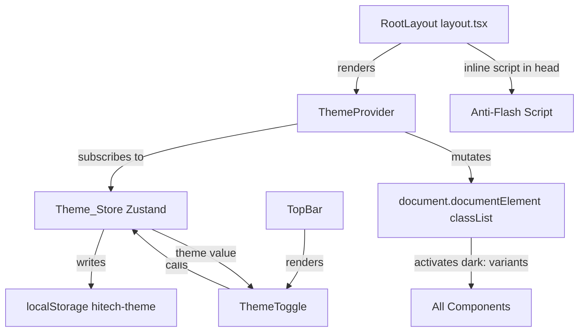

# Design Document: Dark Mode Toggle

## Overview

This document describes the technical design for adding a light/dark mode toggle to the Hi-Tech Waste Management Platform. The feature introduces a Zustand-managed theme store, a client-side ThemeProvider that synchronises the `dark` CSS class on `<html>`, and a ThemeToggle button in the TopBar. Tailwind CSS's class-based `dark:` variant strategy is used throughout, meaning a single `.dark` class on the root `<html>` element activates all dark-mode styles across every page and component.

### Current State

The application currently hardcodes `className="... dark"` on the `<html>` element in `frontend/src/app/layout.tsx` and sets `colorScheme: 'dark'` in the viewport export. The `globals.css` file already defines both `:root` (light) and `.dark` (dark) CSS variable blocks. The Sidebar, NotificationPanel, UserDropdown, and page content areas use hardcoded Tailwind light-palette classes (`bg-white`, `text-gray-*`, `border-gray-*`) that do not respond to the `.dark` class.

### Target State

- The hardcoded `dark` class is removed from the root layout.
- A `ThemeProvider` reads `localStorage` on mount and applies the correct class.
- An inline anti-flash script in `<head>` prevents a white flash before hydration.
- All layout components gain `dark:` Tailwind variants.
- shadcn/ui primitives (Dialog, Popover, Select, etc.) are covered automatically via the CSS variable overrides in `globals.css`.
- The user's preference persists across sessions via `localStorage` key `hitech-theme`.

---

## Architecture

### Theme Mechanism: Class-Based Tailwind Dark Mode

Tailwind is configured with `darkMode: 'class'` (the default for shadcn/ui projects). When the `.dark` class is present on `<html>`, every `dark:` utility in the codebase activates. This is the only mechanism needed — no CSS-in-JS, no context-based theming, no runtime style injection.

```
localStorage ('hitech-theme')
        │
        ▼
  ThemeProvider (mount)
        │  reads stored value, falls back to 'light'
        ▼
  Theme_Store (Zustand)
   theme: 'light' | 'dark'
   toggleTheme()
        │
        ├─── writes to localStorage on every change
        │
        └─── ThemeProvider subscriber
                  │
                  ▼
         document.documentElement
           .classList.add/remove('dark')
                  │
                  ▼
         Tailwind dark: variants activate
         CSS variables resolve to dark palette
```

### Anti-Flash Strategy

Server-rendered HTML is delivered without the `dark` class (since the hardcoded class is removed). Before React hydrates, there is a window where the page renders in light mode even if the user prefers dark — causing a visible flash. This is prevented by an **inline synchronous script** injected into `<head>` that runs before any paint:

```html
<script>
  (function() {
    try {
      var t = localStorage.getItem('hitech-theme');
      if (t === 'dark') document.documentElement.classList.add('dark');
    } catch(e) {}
  })();
</script>
```

This script is inlined as a `<script dangerouslySetInnerHTML>` in the root layout's `<head>`. It is synchronous and tiny (~120 bytes), so it does not block meaningful paint. The `try/catch` guards against environments where `localStorage` is unavailable (SSR, private browsing with storage blocked).

### Component Interaction



---

## Components and Interfaces

### 1. `frontend/src/lib/theme-store.ts` — Zustand Theme Store

**Responsibility:** Single source of truth for the active theme. Exposes `theme` and `toggleTheme`. Writes to `localStorage` on every change.

```typescript
interface ThemeState {
  theme: 'light' | 'dark'
  toggleTheme: () => void
}
```

**Implementation notes:**
- Initialised to `'light'` as the Zustand default. The ThemeProvider overwrites this on mount after reading `localStorage`.
- `toggleTheme` uses `set` to flip the value and immediately writes to `localStorage`.
- The store does **not** touch `document.documentElement` — that is the ThemeProvider's responsibility. This keeps the store pure and testable without a DOM.
- The store is completely independent of all other Zustand stores in the application.

### 2. `frontend/src/components/layout/ThemeProvider.tsx` — Theme Synchronisation

**Responsibility:** Client component that bridges the Zustand store and the DOM. Runs once on mount to hydrate the store from `localStorage`, then subscribes to store changes to keep the `<html>` class in sync.

```typescript
'use client'
// Props: { children: React.ReactNode }
// - On mount: reads localStorage.getItem('hitech-theme'), calls useThemeStore.setState
// - Subscribes via useEffect to theme changes → add/remove 'dark' on documentElement
// - Renders children directly (no wrapper element)
```

**Implementation notes:**
- Uses `suppressHydrationWarning` on `<html>` (already present in layout.tsx) to suppress the mismatch between server-rendered HTML (no `dark` class) and client-hydrated HTML (with `dark` class if stored).
- The `useEffect` that reads `localStorage` runs only on the client, so there is no SSR mismatch.
- A second `useEffect` subscribes to `theme` changes from the store and updates `document.documentElement.classList` accordingly.

### 3. `frontend/src/components/layout/ThemeToggle.tsx` — Toggle Button

**Responsibility:** Renders a 32×32px button in the TopBar with a Sun or Moon icon. Calls `toggleTheme` on click.

```typescript
'use client'
// - Reads theme from useThemeStore
// - Renders <button> with aria-label, min 32×32px touch target
// - Shows <Sun> icon when theme === 'dark' (click will switch to light)
// - Shows <Moon> icon when theme === 'light' (click will switch to dark)
// - Icon transitions: opacity + rotate via Tailwind transition classes
```

**Icon logic:**
| Active theme | Icon shown | aria-label |
|---|---|---|
| `light` | `Moon` | "Switch to dark mode" |
| `dark` | `Sun` | "Switch to light mode" |

### 4. Modifications to Existing Files

#### `frontend/src/app/layout.tsx`

| Change | Before | After |
|---|---|---|
| Remove hardcoded dark class | `className={\`${inter.variable} dark\`}` | `className={inter.variable}` |
| Add anti-flash script | _(absent)_ | Inline `<script>` in `<head>` |
| Add ThemeProvider | _(absent)_ | Wraps `<Providers>` children |
| Update viewport colorScheme | `colorScheme: 'dark'` | `colorScheme: 'light dark'` |

#### `frontend/src/app/providers.tsx`

ThemeProvider is imported and wraps the children inside `Providers`:

```tsx
// Inside Providers component:
<SessionProvider ...>
  <ReactQueryProvider>
    <ThemeProvider>
      {children}
    </ThemeProvider>
  </ReactQueryProvider>
</SessionProvider>
```

#### `frontend/src/app/globals.css`

Add a global transition rule in `@layer base` so colour changes animate smoothly:

```css
*, *::before, *::after {
  transition: background-color 200ms ease, color 200ms ease,
              border-color 200ms ease, fill 200ms ease;
}
```

This rule is added **after** the existing `* { @apply border-border; }` rule. The `fill` property covers SVG icons.

The existing `.dark` CSS variable block is already well-defined. Verify the following values match the target dark palette:

| Variable | Current `.dark` value | Target |
|---|---|---|
| `--background` | `222.2 84% 4.9%` (≈ slate-950) | ✓ correct |
| `--card` | `217.2 32.6% 17.5%` (≈ slate-800) | ✓ correct |
| `--border` | `217.2 32.6% 17.5%` (≈ slate-700) | ✓ correct |
| `--input` | `217.2 32.6% 17.5%` | ✓ correct |
| `--popover` | `222.2 84% 4.9%` | ✓ correct |

No CSS variable changes are required — the existing `.dark` block already maps to the target slate palette.

#### `frontend/src/components/layout/Sidebar.tsx`

All hardcoded light-palette classes gain `dark:` counterparts:

| Element | Light classes | Added dark: classes |
|---|---|---|
| Outer container | `bg-white border-r border-gray-200` | `dark:bg-slate-900 dark:border-slate-700` |
| Nav group divider | `border-t border-gray-100` | `dark:border-slate-800` |
| Group label text | `text-gray-400` | `dark:text-slate-500` |
| NavLink default | `text-gray-600 hover:bg-gray-50 hover:text-gray-900` | `dark:text-slate-300 dark:hover:bg-slate-800 dark:hover:text-white` |
| NavLink active | `bg-teal-600/10 text-teal-700 ring-teal-600/20` | `dark:bg-teal-900/20 dark:text-teal-400 dark:ring-teal-700/30` |
| NavLink highlight | `text-teal-600 hover:bg-teal-50` | `dark:text-teal-400 dark:hover:bg-teal-900/20` |
| NavLink icon default | `text-gray-400 group-hover:text-gray-600` | `dark:text-slate-500 dark:group-hover:text-slate-300` |
| NavLink active icon | `text-teal-600` | `dark:text-teal-400` |
| AI badge | `text-teal-600 bg-teal-50 border-teal-200` | `dark:text-teal-400 dark:bg-teal-900/30 dark:border-teal-700` |
| Tooltip | `text-white bg-gray-800` | _(already dark — no change)_ |
| User strip container | `border-t border-gray-100 bg-white` | `dark:border-slate-800 dark:bg-slate-900` |
| User name | `text-gray-800` | `dark:text-slate-100` |
| User role | `text-gray-400` | `dark:text-slate-500` |
| Collapse button | `border-t border-gray-200 bg-gray-50 text-gray-500 hover:text-gray-700 hover:bg-gray-100` | `dark:border-slate-800 dark:bg-slate-900 dark:text-slate-400 dark:hover:text-slate-200 dark:hover:bg-slate-800` |

#### `frontend/src/components/layout/TopBar.tsx`

The TopBar uses a teal gradient (`bg-gradient-to-r from-teal-800 to-teal-700`) which is already dark — no background change needed. The ThemeToggle is inserted between `<SearchBar />` and `<NotificationBell />` in the right-side actions `<div>`.

The `UserDropdown` panel (the white dropdown that opens below the avatar) needs dark variants:

| Element | Light classes | Added dark: classes |
|---|---|---|
| Dropdown panel | `bg-white border-gray-200` | `dark:bg-slate-800 dark:border-slate-700` |
| Header divider | `border-b border-gray-100` | `dark:border-slate-700` |
| User name | `text-gray-900` | `dark:text-slate-100` |
| User email | `text-gray-500` | `dark:text-slate-400` |
| Role badge | `bg-teal-50 text-teal-700 border-teal-200` | `dark:bg-teal-900/30 dark:text-teal-400 dark:border-teal-700` |
| Menu items | `text-gray-700 hover:text-gray-900 hover:bg-gray-50` | `dark:text-slate-300 dark:hover:text-white dark:hover:bg-slate-700` |
| Menu item icons | `text-gray-400` | `dark:text-slate-500` |
| Footer divider | `border-t border-gray-100` | `dark:border-slate-700` |
| Sign out | `text-red-500 hover:bg-red-50` | `dark:hover:bg-red-900/20` |

#### `frontend/src/components/layout/NotificationPanel.tsx`

| Element | Light classes | Added dark: classes |
|---|---|---|
| Panel background | `bg-white border-l border-gray-200` | `dark:bg-slate-900 dark:border-slate-700` |
| Header | `bg-white border-b border-gray-200` | `dark:bg-slate-900 dark:border-slate-700` |
| Header icon/text | `text-gray-500`, `text-gray-900` | `dark:text-slate-400`, `dark:text-slate-100` |
| Actions bar | `bg-gray-50 border-b border-gray-200` | `dark:bg-slate-800 dark:border-slate-700` |
| Actions bar text | `text-gray-500` | `dark:text-slate-400` |
| Alert item border | `border-b border-gray-100` | `dark:border-slate-800` |
| Unread alert bg | `bg-blue-50/40 hover:bg-blue-50/60` | `dark:bg-blue-900/10 dark:hover:bg-blue-900/20` |
| Alert title (unread) | `text-gray-900` | `dark:text-slate-100` |
| Alert title (read) | `text-gray-400` | `dark:text-slate-500` |
| Alert message | `text-gray-500` | `dark:text-slate-400` |
| Alert timestamp | `text-gray-400` | `dark:text-slate-500` |
| Module badge | `bg-gray-100 text-gray-500 border-gray-200` | `dark:bg-slate-700 dark:text-slate-400 dark:border-slate-600` |
| Mark read button | `text-gray-400 hover:text-gray-700` | `dark:text-slate-500 dark:hover:text-slate-200` |
| Dismiss button | `text-gray-400 hover:text-gray-600` | `dark:text-slate-500 dark:hover:text-slate-300` |
| Section sticky header | `bg-white/90` | `dark:bg-slate-900/90` |
| Section label | `text-gray-400` | `dark:text-slate-500` |
| Empty state icon bg | `bg-gray-100` | `dark:bg-slate-800` |
| Empty state icon | `text-gray-400` | `dark:text-slate-500` |
| Empty state text | `text-gray-700`, `text-gray-400` | `dark:text-slate-300`, `dark:text-slate-500` |
| Skeleton lines | `bg-gray-200` | `dark:bg-slate-700` |
| Footer | `border-t border-gray-200 bg-white` | `dark:border-slate-700 dark:bg-slate-900` |
| Footer link | `text-gray-500 hover:text-gray-900 border-gray-200 hover:border-gray-300` | `dark:text-slate-400 dark:hover:text-slate-100 dark:border-slate-700 dark:hover:border-slate-600` |

#### `frontend/src/app/(dashboard)/layout.tsx`

| Element | Light classes | Added dark: classes |
|---|---|---|
| Outer flex wrapper | `bg-white` | `dark:bg-slate-950` |
| Loading screen | `bg-white` | `dark:bg-slate-950` |
| Loading text | `text-gray-400` | `dark:text-slate-500` |
| `<main>` | `bg-white` | `dark:bg-slate-950` |

#### `frontend/src/app/(auth)/login/page.tsx`

The auth layout wrapper uses a teal gradient background — this is already dark and looks correct in dark mode. The white card (`bg-white border-gray-200`) needs dark variants:

| Element | Light classes | Added dark: classes |
|---|---|---|
| Card container (in auth layout) | `bg-white border-gray-200` | `dark:bg-slate-800 dark:border-slate-700` |
| Page title | `text-gray-900` | `dark:text-slate-100` |
| Subtitle | `text-gray-500` | `dark:text-slate-400` |
| Input fields | `bg-gray-50 border-gray-300 text-gray-900 placeholder-gray-400` | `dark:bg-slate-900 dark:border-slate-600 dark:text-white dark:placeholder-slate-500` |
| Label text | `text-gray-500` | `dark:text-slate-400` |
| Error banner | `bg-red-50 border-red-200 text-red-600` | `dark:bg-red-900/20 dark:border-red-800 dark:text-red-400` |
| Divider lines | `bg-gray-200` | `dark:bg-slate-700` |
| Divider text | `text-gray-400` | `dark:text-slate-500` |
| Footer note | `text-gray-400` | `dark:text-slate-500` |

---

## Data Models

### Theme Store State

```typescript
// frontend/src/lib/theme-store.ts
type Theme = 'light' | 'dark'

interface ThemeState {
  theme: Theme
  toggleTheme: () => void
}
```

### localStorage Schema

| Key | Type | Values | Default |
|---|---|---|---|
| `hitech-theme` | `string` | `'light'` \| `'dark'` | `'light'` (absent = light) |

### CSS Variable Mapping

The existing `globals.css` already defines the full variable set. The mapping between Tailwind tokens and dark-palette values:

| Tailwind token | CSS variable | Dark value (HSL) | Approximate Tailwind colour |
|---|---|---|---|
| `bg-background` | `--background` | `222.2 84% 4.9%` | slate-950 |
| `bg-card` | `--card` | `217.2 32.6% 17.5%` | slate-800 |
| `bg-popover` | `--popover` | `222.2 84% 4.9%` | slate-950 |
| `border-border` | `--border` | `217.2 32.6% 17.5%` | slate-700 |
| `bg-input` | `--input` | `217.2 32.6% 17.5%` | slate-700 |
| `text-foreground` | `--foreground` | `210 40% 98%` | slate-50 |
| `text-muted-foreground` | `--muted-foreground` | `215 20.2% 65.1%` | slate-400 |
| `bg-primary` | `--primary` | `142.1 70.6% 45.3%` | emerald-500 |

shadcn/ui components (Dialog, Popover, Select, DropdownMenu, Table, etc.) consume these variables exclusively, so they gain dark mode automatically without any `dark:` class additions.

---

## Correctness Properties

*A property is a characteristic or behavior that should hold true across all valid executions of a system — essentially, a formal statement about what the system should do. Properties serve as the bridge between human-readable specifications and machine-verifiable correctness guarantees.*

The project uses **Vitest** as the test runner and **fast-check** as the property-based testing library (both already installed as devDependencies). Each property test is configured to run a minimum of 100 iterations.

### Property Reflection

Before writing properties, reviewing the prework for redundancy:

- 1.3 (toggle alternates theme) and 7.4 (toggle does not affect other stores) are independent — both kept.
- 2.2 (localStorage read on init) and 2.4 (localStorage write on toggle) are complementary round-trip properties — they can be combined into a single round-trip property.
- 2.5 (HTML class sync) is independent of the localStorage properties — kept separate.
- 7.1 (no API calls on toggle) and 7.4 (no other store mutation) are both no-side-effects properties — they can be combined into one "theme toggle has no side effects on other state" property.

After reflection: 5 properties remain, each providing unique validation value.

---

### Property 1: Toggle Alternation Invariant

*For any* starting theme value and any positive integer `n`, after calling `toggleTheme()` exactly `n` times, the resulting theme equals the starting theme if `n` is even, and the opposite theme if `n` is odd.

**Validates: Requirements 1.3**

---

### Property 2: localStorage Round-Trip

*For any* valid theme value (`'light'` or `'dark'`), after the ThemeProvider initialises with that value stored in `localStorage['hitech-theme']`, the Theme_Store's `theme` equals that value; and after calling `toggleTheme()`, `localStorage.getItem('hitech-theme')` equals the new (opposite) theme value.

**Validates: Requirements 2.2, 2.4**

---

### Property 3: HTML Class Synchronisation

*For any* theme value, after the ThemeProvider applies it, `document.documentElement.classList.contains('dark')` is `true` if and only if `theme === 'dark'`.

**Validates: Requirements 2.5**

---

### Property 4: Default Initialisation

*For any* state of `localStorage` that does not contain the key `hitech-theme` (absent, null, or an unrecognised value), the Theme_Store SHALL initialise with `theme === 'light'`.

**Validates: Requirements 2.3**

---

### Property 5: Theme Toggle Has No Side Effects on Other State

*For any* sequence of `toggleTheme()` calls, no other Zustand store state is mutated, no TanStack Query cache entries are invalidated or refetched, and no API calls are triggered.

**Validates: Requirements 7.1, 7.4**

---

## Error Handling

### localStorage Unavailable

`localStorage` access can throw in certain environments (SSR, private browsing with storage blocked, browser extensions). All `localStorage` reads and writes in both the anti-flash script and the ThemeProvider are wrapped in `try/catch`. On failure, the theme silently falls back to `'light'`.

```typescript
function getStoredTheme(): Theme {
  try {
    const stored = localStorage.getItem('hitech-theme')
    return stored === 'dark' ? 'dark' : 'light'
  } catch {
    return 'light'
  }
}

function setStoredTheme(theme: Theme): void {
  try {
    localStorage.setItem('hitech-theme', theme)
  } catch {
    // Silently ignore — theme still works for the current session
  }
}
```

### SSR / Hydration Mismatch

The root `<html>` element already has `suppressHydrationWarning`. The ThemeProvider only reads `localStorage` inside `useEffect` (client-only), so the server always renders without the `dark` class. The anti-flash inline script applies the class synchronously before the first paint, preventing a visible flash. React's hydration sees the class already present and does not produce a mismatch warning.

### Invalid localStorage Value

If `localStorage['hitech-theme']` contains an unexpected value (e.g. `'system'`, `'auto'`, or corrupted data), the `getStoredTheme` function treats any non-`'dark'` string as `'light'`. This is a safe default.

---

## Testing Strategy

### Unit Tests (Vitest + Testing Library)

**Theme Store (`theme-store.test.ts`)**
- Initial state is `'light'`
- `toggleTheme()` changes `'light'` → `'dark'`
- `toggleTheme()` changes `'dark'` → `'light'`
- `toggleTheme()` writes to `localStorage`
- Store does not expose or mutate any non-theme state

**ThemeProvider (`ThemeProvider.test.tsx`)**
- Reads `localStorage` on mount and sets store theme
- Adds `dark` class to `document.documentElement` when theme is `'dark'`
- Removes `dark` class when theme is `'light'`
- Defaults to `'light'` when `localStorage` is empty
- Handles `localStorage` throwing without crashing

**ThemeToggle (`ThemeToggle.test.tsx`)**
- Renders Moon icon when theme is `'light'`
- Renders Sun icon when theme is `'dark'`
- `aria-label` is "Switch to dark mode" in light mode
- `aria-label` is "Switch to light mode" in dark mode
- Clicking calls `toggleTheme`
- Button has minimum 32px dimensions

### Property-Based Tests (Vitest + fast-check)

Each property test runs with `{ numRuns: 100 }` minimum. Tests are tagged with a comment referencing the design property.

**`theme-store.property.test.ts`**

```typescript
// Feature: dark-mode-toggle, Property 1: Toggle Alternation Invariant
it('toggleTheme alternates correctly for any n', () => {
  fc.assert(fc.property(
    fc.constantFrom('light', 'dark') as fc.Arbitrary<Theme>,
    fc.integer({ min: 1, max: 20 }),
    (startTheme, n) => {
      // initialise store with startTheme, call toggleTheme n times,
      // assert result === (n % 2 === 0 ? startTheme : opposite(startTheme))
    }
  ), { numRuns: 100 })
})

// Feature: dark-mode-toggle, Property 2: localStorage Round-Trip
it('localStorage round-trip preserves theme', () => {
  fc.assert(fc.property(
    fc.constantFrom('light', 'dark') as fc.Arbitrary<Theme>,
    (storedTheme) => {
      // set localStorage, init provider, assert store.theme === storedTheme
      // call toggleTheme, assert localStorage === opposite(storedTheme)
    }
  ), { numRuns: 100 })
})

// Feature: dark-mode-toggle, Property 3: HTML Class Synchronisation
it('dark class on html matches theme state', () => {
  fc.assert(fc.property(
    fc.constantFrom('light', 'dark') as fc.Arbitrary<Theme>,
    (theme) => {
      // apply theme via provider, assert classList.contains('dark') === (theme === 'dark')
    }
  ), { numRuns: 100 })
})

// Feature: dark-mode-toggle, Property 4: Default Initialisation
it('defaults to light for any missing/invalid localStorage value', () => {
  fc.assert(fc.property(
    fc.oneof(
      fc.constant(null),
      fc.constant(undefined),
      fc.string().filter(s => s !== 'light' && s !== 'dark')
    ),
    (invalidValue) => {
      // set localStorage to invalidValue (or clear it), init provider,
      // assert store.theme === 'light'
    }
  ), { numRuns: 100 })
})

// Feature: dark-mode-toggle, Property 5: Theme Toggle Has No Side Effects
it('toggleTheme does not mutate any other store state', () => {
  fc.assert(fc.property(
    fc.integer({ min: 1, max: 10 }),
    (n) => {
      // snapshot all other store states, call toggleTheme n times,
      // assert all other store states are unchanged
    }
  ), { numRuns: 100 })
})
```

### Integration Tests

- Toggle theme during an active mock WebSocket connection — assert connection state remains `'open'`
- Render full dashboard layout in both themes — assert no console errors

### What is NOT Tested with PBT

- CSS class presence on individual components (snapshot tests)
- WCAG contrast ratios (manual audit with axe-core)
- Icon animation timing (visual/manual)
- Touch target size (visual/manual)
- Anti-flash script presence in `<head>` (example test)

---

## Migration Notes

### Removing the Hardcoded `dark` Class

The root layout currently has:
```tsx
<html lang="en" className={`${inter.variable} dark`} suppressHydrationWarning>
```

This becomes:
```tsx
<html lang="en" className={inter.variable} suppressHydrationWarning>
```

The `dark` class is now applied exclusively by the ThemeProvider via `document.documentElement.classList`. The anti-flash inline script ensures the class is applied before the first paint for users who have previously selected dark mode.

### Viewport colorScheme

The viewport export currently sets `colorScheme: 'dark'`. This should be updated to `colorScheme: 'light dark'` to signal to the browser that both schemes are supported:

```typescript
export const viewport: Viewport = {
  colorScheme: 'light dark',
  // ...
}
```

### Rollout Order

To avoid a broken intermediate state, changes should be applied in this order:

1. Add `globals.css` transition rule (safe, additive)
2. Create `theme-store.ts` (new file, no side effects)
3. Create `ThemeProvider.tsx` (new file, no side effects)
4. Create `ThemeToggle.tsx` (new file, no side effects)
5. Update `providers.tsx` to include ThemeProvider
6. Update `layout.tsx`: remove hardcoded `dark`, add anti-flash script, update viewport
7. Add `dark:` variants to Sidebar, NotificationPanel, TopBar UserDropdown
8. Add `dark:` variants to dashboard layout and login page
9. Run full visual regression pass in both themes
