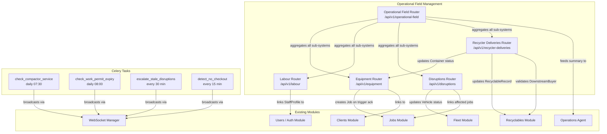

# Design Document: Operational Field Management

## Overview

The Operational Field Management feature adds five tightly integrated sub-systems to the Hi-Tech Waste Management platform, replacing informal WhatsApp coordination and manual tracking with structured, auditable, platform-native workflows:

1. **Compaction Equipment Tracking** — deployment registry, utilisation calculation, and maintenance scheduling for hydraulic compaction machines
2. **Container Logistics** — container inventory, fill-level tracking, pickup triggers, and transport workflow
3. **Labour Deployment Management** — site-based team assignments and shift scheduling for ~50 field staff
4. **Operational Disruption Log** — structured logging of landfill delays, highway restrictions, and vehicle breakdowns with job impact tracking and resolution workflow
5. **Recycler Delivery Workflow** — container-to-recycler delivery with proof of delivery, weight reconciliation, and downstream buyer confirmation

All five sub-systems integrate with the existing Jobs, Fleet, Recyclables, Clients, and Users modules. A unified Operational Dashboard endpoint aggregates live status across all sub-systems. A cross-cutting Audit Trail records every state change. Role-Based Access Control enforces data access boundaries.

### Key Design Decisions

- **Co-located models and schemas**: Each `models/*.py` file contains both the SQLAlchemy ORM class and its Pydantic schemas, consistent with the existing codebase pattern.
- **Async FastAPI routers**: All endpoints use `AsyncSession` via `get_db()` dependency, consistent with existing routers.
- **Celery for scheduled tasks**: Background jobs (maintenance alerts, disruption escalation, permit expiry, no-checkout detection) use the existing `AgentBaseTask` base class and `SyncSessionLocal` for DB access.
- **Audit trail via SQLAlchemy events**: A generic `AuditLog` model captures all state changes; writes are atomic with the originating operation using SQLAlchemy's `after_flush` event hooks.
- **Encrypted PII**: IC/passport numbers for foreign workers are encrypted at the application layer before storage, using Fernet symmetric encryption with the app's `SECRET_KEY`.
- **MQTT-ready fill levels**: The `ContainerFillReading` model is designed to accept readings from both manual API submissions and future IoT sensor integrations via the existing MQTT gateway.

---

## Architecture

### Sub-system Integration Map



### Request Flow

All API requests follow the existing pattern:

```
Client → Next.js (api.ts) → FastAPI Router → SQLAlchemy AsyncSession → PostgreSQL
                                           ↓
                                    AuditLog write (atomic)
                                           ↓
                                    WebSocket broadcast (non-blocking)
```

Celery tasks use `SyncSessionLocal` (psycopg2) and broadcast alerts via `POST /internal/broadcast-alert`.

---

## Components and Interfaces

### Backend Routers

| Router File | Prefix | Responsibility |
|---|---|---|
| `routers/equipment.py` | `/api/v1/equipment` | Compaction machines, deployments, maintenance, containers, fill levels, pickup triggers, transport |
| `routers/labour.py` | `/api/v1/labour` | Staff profiles, site assignments, shifts, attendance |
| `routers/disruptions.py` | `/api/v1/disruptions` | Disruption log CRUD, job impact, resolution workflow |
| `routers/recycler_deliveries.py` | `/api/v1/recycler-deliveries` | Delivery manifest, proof of delivery, reconciliation, buyer confirmation |
| `routers/operational_field.py` | `/api/v1/operational-field` | Aggregated summary, job disruptions cross-reference, audit log |

### Celery Tasks

| Task | Schedule | Purpose |
|---|---|---|
| `check_compactor_service` | Daily 07:30 MST (23:30 UTC) | Escalate overdue machines to `maintenance`; warn within 14 days |
| `check_work_permit_expiry` | Daily 08:00 MST (00:00 UTC) | Alert 30 days before foreign worker permit expiry |
| `escalate_stale_disruptions` | Every 30 minutes | Escalate open disruptions > 4 hours to `critical` |
| `detect_no_checkout` | Every 15 minutes | Mark `no_checkout` for staff who missed shift end without checking out |

### Frontend Pages and Components

| Page | Path | Components |
|---|---|---|
| Equipment | `/equipment` | `CompactorForm`, `ContainerForm`, `FillBar`, `SummaryCard`, `StatusBadge` |
| Labour | `/labour` | `StaffTable`, `SiteAssignmentForm`, `ShiftScheduler`, `AttendanceTable` |
| Disruptions | `/disruptions` | `DisruptionForm`, `DisruptionTable`, `ResolutionPanel` |
| Recycler Deliveries | `/recycler-deliveries` | `DeliveryForm`, `ProofOfDeliveryForm`, `ReconciliationPanel`, `BuyerConfirmationForm` |
| Dashboard | `/dashboard` | `OperationalFieldSummaryCard` (new widget added to existing dashboard) |

### Frontend API Client (`src/lib/api.ts`)

New API client objects added to the existing `api.ts`:

- `equipmentApi` — compactors, containers, fill levels, pickup triggers, transport
- `labourApi` — staff, site assignments, shifts, attendance, hours summary
- `disruptionsApi` — disruption CRUD, impact, resolution, closure
- `recyclerDeliveriesApi` — delivery manifest, depart/arrive, proof, reconciliation, buyer confirmation
- `operationalFieldApi` — summary, audit log

### TypeScript Types (`src/types/operational-field.ts`)

All domain types are defined in a single file:
`CompactionMachine`, `CompactorDeployment`, `CompactorMaintenanceLog`, `Container`, `FillReading`, `PickupTrigger`, `TransportLogEntry`, `StaffProfile`, `SiteAssignment`, `Shift`, `ShiftAttendance`, `DisruptionLog`, `DisruptionJobImpact`, `RecyclerDelivery`, `ReconciliationDetails`, `OperationalFieldSummary`, `AuditLogEntry`

---

## Data Models

### AuditLog

```python
class AuditLog(Base):
    __tablename__ = "audit_logs"

    id: UUID (PK)
    entity_type: str(50)          # compaction_machine | container | site_assignment |
                                   # shift | disruption_log | recycler_delivery
    entity_id: UUID
    operation: str(20)             # create | update | status_change
    previous_state: JSON (nullable)
    new_state: JSON
    changed_by: UUID → users.id (SET NULL)
    changed_at: DateTime(tz=True)  # server_default=func.now()
```

Audit writes are triggered via a SQLAlchemy `after_flush` session event registered in `database.py`. The event inspects `session.new`, `session.dirty`, and `session.deleted` for tracked entity types and writes `AuditLog` records in the same transaction.

### CompactionMachine (existing — `models/equipment.py`)

Already implemented. Key fields: `id`, `asset_tag`, `model_name`, `serial_number`, `status`, `purchase_date`, `compaction_force_kn`, `maintenance_interval_days` (default 90), `last_service_date`, `next_service_date`.

### CompactorDeployment (existing — `models/equipment.py`)

Already implemented. Key fields: `id`, `machine_id`, `client_id`, `site_address`, `deployment_start`, `deployment_end`, `authorised_by`.

### CompactorMaintenanceLog (existing — `models/equipment.py`)

Already implemented. Key fields: `id`, `machine_id`, `service_date`, `service_type`, `technician_name`, `cost_myr`, `logged_by`.

### Container (existing — `models/equipment.py`)

Already implemented. Key fields: `id`, `container_code`, `container_type`, `capacity_m3`, `status`, `current_client_id`, `current_site_address`, `current_compactor_id`, `target_material_type`, `fill_level`, `pickup_threshold` (default 85), `assigned_date`.

### ContainerFillReading (existing — `models/equipment.py`)

Already implemented. Key fields: `id`, `container_id`, `fill_level`, `recorded_at`, `reported_by`, `photo_url`.

### PickupTrigger (existing — `models/equipment.py`)

Already implemented. Key fields: `id`, `container_id`, `triggered_at`, `fill_level_at_trigger`, `acknowledged_at`, `acknowledged_by`, `linked_job_id`, `is_active`, `closed_at`.

### ContainerTransportLog (existing — `models/equipment.py`)

Already implemented. Key fields: `id`, `container_id`, `from_status`, `to_status`, `transitioned_at`, `responsible_user_id`, `vehicle_id`.

### StaffProfile (existing — `models/labour.py`)

Already implemented. Key fields: `id`, `user_id`, `employment_type`, `labour_agent_name`, `id_number_encrypted`, `assignment_status`, `current_site_assignment_id`, `work_permit_expiry`.

### StaffStatusHistory (existing — `models/labour.py`)

Already implemented. Key fields: `id`, `staff_profile_id`, `previous_status`, `new_status`, `changed_at`, `changed_by`.

### SiteAssignment (existing — `models/labour.py`)

Already implemented. Key fields: `id`, `client_id`, `site_address`, `supervisor_id`, `start_date`, `end_date`, `is_active`, `created_by`. Junction table `SiteAssignmentMember` links staff profiles with `role_at_site`.

### Shift (existing — `models/labour.py`)

Already implemented. Key fields: `id`, `site_assignment_id`, `shift_date`, `shift_type`, `start_time`, `end_time`, `created_by`.

### ShiftAttendance (existing — `models/labour.py`)

Already implemented. Key fields: `id`, `shift_id`, `staff_profile_id`, `status`, `check_in_at`, `check_out_at`, `absence_reason`, `recorded_by`.

### DisruptionLog (existing — `models/disruption.py`)

Already implemented. Key fields: `id`, `disruption_type`, `status`, `severity`, `occurred_at`, `reported_by`, `description`, `affected_job_ids` (ARRAY), `vehicle_id`, `highway_name`, `restriction_start_time`, `restriction_end_time`, `resolver_id`, `resolution_history` (JSON array), `closure_note`, `closed_at`, `closed_by`.

### DisruptionJobImpact (existing — `models/disruption.py`)

Already implemented. Key fields: `id`, `disruption_id`, `job_id`, `estimated_delay_minutes`, `original_scheduled_completion`, `revised_estimated_completion`.

### RecyclerDelivery (existing — `models/recycler_delivery.py`)

Already implemented. Key fields: `id`, `container_id`, `buyer_id`, `vehicle_id`, `driver_id`, `status`, `declared_material_breakdown` (JSON), `declared_total_weight_kg`, `planned_departure_at`, `departed_at`, `arrived_at`, `proof_photos` (JSON array), `weight_ticket_ref`, `recycler_recorded_weight_kg`, `proof_submitted_at`, `weight_variance_kg`, `weight_variance_pct`, `reconciliation_status`, `reconciliation_justification`, `buyer_rep_name`, `buyer_confirmed_breakdown` (JSON), `buyer_reference_number`, `buyer_confirmed_at`, `recyclable_record_id`.

### Alembic Migration

A new migration `add_operational_field_tables.py` creates:
- `compaction_machines`, `compactor_deployments`, `compactor_maintenance_logs`
- `containers`, `container_fill_readings`, `pickup_triggers`, `container_transport_logs`
- `staff_profiles`, `staff_status_history`, `site_assignments`, `site_assignment_members`, `shifts`, `shift_attendances`
- `disruption_logs`, `disruption_job_impacts`
- `recycler_deliveries`
- `audit_logs`

---

## API Endpoint Summary

### Equipment (`/api/v1/equipment`)

| Method | Path | Description | Roles |
|---|---|---|---|
| GET | `/compactors` | List all compaction machines | All authenticated |
| POST | `/compactors` | Register new compaction machine | superadmin, operations_manager |
| GET | `/compactors/due-service` | Machines due within 30 days | All authenticated |
| GET | `/compactors/{id}` | Get machine detail | All authenticated |
| PATCH | `/compactors/{id}` | Update machine | superadmin, operations_manager |
| GET | `/compactors/{id}/deployments` | Deployment history | All authenticated |
| POST | `/compactors/{id}/deployments` | Deploy machine to site | superadmin, operations_manager |
| POST | `/compactors/{id}/deployments/{dep_id}/retrieve` | Retrieve machine from site | superadmin, operations_manager |
| GET | `/compactors/{id}/maintenance` | Maintenance log | All authenticated |
| POST | `/compactors/{id}/maintenance` | Log maintenance event | superadmin, operations_manager |
| GET | `/containers` | List all containers | All authenticated |
| POST | `/containers` | Register new container | superadmin, operations_manager |
| GET | `/containers/{id}` | Get container detail | All authenticated |
| POST | `/containers/{id}/assign-site` | Assign container to site | superadmin, operations_manager |
| POST | `/containers/{id}/fill-level` | Record fill reading | All authenticated |
| GET | `/containers/{id}/fill-history` | Fill level history | All authenticated |
| GET | `/containers/{id}/transport-log` | Transport history | All authenticated |
| POST | `/containers/{id}/transport` | Update transport status | All authenticated |
| POST | `/containers/{id}/pickup-triggers/{tid}/acknowledge` | Acknowledge pickup trigger | superadmin, operations_manager |

### Labour (`/api/v1/labour`)

| Method | Path | Description | Roles |
|---|---|---|---|
| GET | `/staff` | List all staff profiles | All authenticated |
| POST | `/staff` | Create staff profile | superadmin, operations_manager |
| GET | `/staff/{id}` | Get staff profile | All authenticated |
| PATCH | `/staff/{id}` | Update staff profile | superadmin, operations_manager |
| GET | `/staff/{id}/hours-summary` | Weekly hours summary | All authenticated |
| GET | `/sites/{client_id}/assignments` | List site assignments | All authenticated |
| POST | `/sites/assignments` | Create site assignment | superadmin, operations_manager, field_supervisor |
| POST | `/sites/assignments/{id}/close` | Close site assignment | superadmin, operations_manager |
| GET | `/shifts` | List shifts (filterable) | All authenticated |
| POST | `/shifts` | Create shift | superadmin, operations_manager, field_supervisor |
| POST | `/shifts/{id}/check-in` | Record check-in | All authenticated |
| POST | `/shifts/{id}/check-out` | Record check-out | All authenticated |
| POST | `/shifts/{id}/mark-absent` | Mark staff absent | All authenticated |
| GET | `/attendance` | Attendance records (filterable) | All authenticated |

### Disruptions (`/api/v1/disruptions`)

| Method | Path | Description | Roles |
|---|---|---|---|
| GET | `/` | List disruptions (filterable) | All authenticated |
| POST | `/` | Create disruption log | superadmin, operations_manager, field_supervisor, driver |
| GET | `/{id}` | Get disruption detail | All authenticated |
| PATCH | `/{id}` | Assign resolver / update severity | superadmin, operations_manager |
| POST | `/{id}/resolution-update` | Add resolution update | All authenticated |
| POST | `/{id}/close` | Close disruption | superadmin, operations_manager |
| GET | `/{id}/impact` | Job impact details | All authenticated |

### Recycler Deliveries (`/api/v1/recycler-deliveries`)

| Method | Path | Description | Roles |
|---|---|---|---|
| GET | `/` | List deliveries (filterable) | All authenticated |
| POST | `/` | Create delivery manifest | superadmin, operations_manager |
| GET | `/{id}` | Get delivery detail | All authenticated |
| POST | `/{id}/depart` | Mark departed | All authenticated |
| POST | `/{id}/arrive` | Mark arrived at recycler | All authenticated |
| POST | `/{id}/proof` | Submit proof of delivery | superadmin, operations_manager, driver |
| GET | `/{id}/reconciliation` | Get reconciliation details | All authenticated |
| POST | `/{id}/reconciliation-review` | Accept/reject discrepancy | superadmin, operations_manager |
| POST | `/{id}/buyer-confirmation` | Record buyer confirmation | superadmin, operations_manager |

### Operational Field (`/api/v1/operational-field`)

| Method | Path | Description | Roles |
|---|---|---|---|
| GET | `/summary` | Aggregated operational summary | All authenticated |
| GET | `/jobs/{job_id}/disruptions` | Disruptions linked to a job | All authenticated |
| GET | `/audit-log` | Audit event log (filterable) | superadmin, operations_manager |

---

## Correctness Properties

*A property is a characteristic or behavior that should hold true across all valid executions of a system — essentially, a formal statement about what the system should do. Properties serve as the bridge between human-readable specifications and machine-verifiable correctness guarantees.*

This feature involves pure business logic functions (status validation, threshold detection, weight reconciliation, utilisation calculation, hours summation) that are well-suited to property-based testing. The property-based testing library used is **Hypothesis** (Python), consistent with the existing `backend/.hypothesis/` directory.

### Property 1: Compaction machine status validation

*For any* string submitted as a `status` value when creating or updating a `CompactionMachine`, the system SHALL accept it if and only if it is one of `{available, deployed, maintenance, decommissioned}`, and reject all other values with HTTP 422.

**Validates: Requirements 1.2**

---

### Property 2: Maintenance next-service-date computation

*For any* `service_date` (a valid calendar date) and `maintenance_interval_days` (a positive integer), when a maintenance log is recorded for a compaction machine, the machine's `next_service_date` SHALL equal `service_date + timedelta(days=maintenance_interval_days)`.

**Validates: Requirements 3.2**

---

### Property 3: Due-service filter correctness

*For any* set of compaction machines with varying `next_service_date` values, the `GET /equipment/compactors/due-service` endpoint SHALL return exactly those machines whose `next_service_date` is within 30 days of today (inclusive), ordered by `next_service_date` ascending.

**Validates: Requirements 3.5**

---

### Property 4: Fill-level history accumulation

*For any* container and any sequence of N fill-level readings submitted in order, the `GET /containers/{id}/fill-history` endpoint SHALL return all N readings, ordered by `recorded_at` descending, with no readings omitted.

**Validates: Requirements 5.2, 5.4**

---

### Property 5: Pickup trigger threshold

*For any* container with a configured `pickup_threshold` T, and any fill-level reading R where R ≥ T, the system SHALL create exactly one active `PickupTrigger` record for that container (idempotent — a second reading above threshold does not create a second trigger while one is already active).

**Validates: Requirements 5.3**

---

### Property 6: Fill-level range validation

*For any* integer value V submitted as `fill_level`, the system SHALL accept it if and only if 0 ≤ V ≤ 100, and reject all values outside this range with HTTP 422.

**Validates: Requirements 5.6**

---

### Property 7: Container lifecycle round-trip

*For any* container that completes the full lifecycle (available → at_site → in_transit → at_recycler → available), the final state SHALL have `fill_level = 0`, `status = available`, and all active `PickupTrigger` records for that container SHALL be closed (`is_active = False`).

**Validates: Requirements 6.4, 17.3**

---

### Property 8: Site assignment requires field supervisor

*For any* `SiteAssignment` creation payload where no member has `role_at_site = field_supervisor`, the system SHALL reject the request with HTTP 422.

**Validates: Requirements 8.2**

---

### Property 9: Staff status transitions on assignment

*For any* staff member added to a `SiteAssignment`, their `assignment_status` SHALL become `on_site` immediately after the assignment is created. *For any* staff member whose assignment is closed or who is removed from it, their `assignment_status` SHALL become `available`.

**Validates: Requirements 8.3, 8.4**

---

### Property 10: Shift time validation

*For any* shift creation payload where `end_time ≤ start_time` on the same calendar date, the system SHALL reject the request with HTTP 422.

**Validates: Requirements 9.4**

---

### Property 11: Weekly hours summation

*For any* staff member with N shifts in a given week, each with a known duration D_i minutes, the `hours-summary` endpoint SHALL return `total_scheduled_hours = sum(D_i) / 60`, rounded to 2 decimal places.

**Validates: Requirements 9.6**

---

### Property 12: Disruption requires at least one affected job

*For any* disruption creation payload with an empty `affected_job_ids` list, the system SHALL reject the request with HTTP 422.

**Validates: Requirements 11.2**

---

### Property 13: Resolution history accumulation

*For any* open disruption log and any sequence of N resolution updates submitted in order, the `resolution_history` JSON array SHALL contain all N updates, each with `text`, `timestamp`, and `resolver_id` fields.

**Validates: Requirements 13.2**

---

### Property 14: Disruption filter correctness

*For any* combination of `status`, `disruption_type`, `date_from`, and `date_to` filter parameters, the `GET /disruptions` endpoint SHALL return exactly those disruption logs that match all provided filters, with no records outside the filter criteria included.

**Validates: Requirements 13.6**

---

### Property 15: Delivery weight reconciliation computation

*For any* recycler delivery where `declared_total_weight_kg = D` and `recycler_recorded_weight_kg = R`, after proof submission the system SHALL compute `weight_variance_kg = |R - D|` and `weight_variance_pct = (|R - D| / D) × 100`, and SHALL set `status = reconciliation_discrepancy` if and only if `weight_variance_pct > 5`.

**Validates: Requirements 16.1, 16.2**

---

### Property 16: Delivery manifest weight tolerance

*For any* delivery creation payload where `|declared_total_weight_kg - sum(declared_material_breakdown.values())| > 0.5`, the system SHALL reject the request with HTTP 422.

**Validates: Requirements 14.3**

---

### Property 17: Operational summary count accuracy

*For any* known set of records across all five sub-systems, the `GET /operational-field/summary` endpoint SHALL return counts that exactly match the actual counts of records in each status category.

**Validates: Requirements 18.1**

---

### Property 18: Audit log completeness

*For any* create, update, or status-change operation on a tracked entity (`CompactionMachine`, `Container`, `SiteAssignment`, `Shift`, `DisruptionLog`, `RecyclerDelivery`), the system SHALL write exactly one `AuditLog` record capturing `entity_type`, `entity_id`, `operation`, `previous_state`, `new_state`, `changed_by`, and `changed_at`, atomically with the originating operation.

**Validates: Requirements 19.1, 19.3**

---

### Property 19: RBAC enforcement

*For any* write operation on `CompactionMachine` or `Container` records, and *for any* user whose role is not in `{superadmin, operations_manager}`, the system SHALL return HTTP 403. Similarly, write operations on `SiteAssignment` and `Shift` records SHALL return HTTP 403 for any user whose role is not in `{superadmin, operations_manager, field_supervisor}`.

**Validates: Requirements 20.1, 20.2, 20.5**

---

## Error Handling

All errors follow the existing envelope format:
```json
{ "error": { "code": <int>, "message": <str>, "detail": <any> } }
```

### Domain-Specific Error Cases

| Scenario | HTTP Status | Detail |
|---|---|---|
| Deploy already-deployed machine | 409 | `"Machine is already deployed at: {site_address}"` |
| Assign non-available container | 409 | `"Container is not available. Current status: {status} at {address}"` |
| Fill level outside 0–100 | 422 | `"fill_level must be between 0 and 100"` |
| Site assignment missing field_supervisor | 422 | `"Site assignment must include at least one member with role 'field_supervisor'"` |
| Overlapping staff assignment | 409 | `"Staff member {id} has overlapping assignment at {site_address}"` |
| Shift end_time ≤ start_time | 422 | `"end_time must be after start_time"` |
| Overlapping shift for same staff | 409 | `"Staff member {id} has an overlapping shift on {date}"` |
| Disruption with no affected jobs | 422 | `"At least one affected job UUID required"` |
| Vehicle breakdown without vehicle_id | 422 | `"vehicle_id is required for vehicle_breakdown disruptions"` |
| Highway restriction without highway_name | 422 | `"highway_name is required for highway_restriction disruptions"` |
| Close vehicle_breakdown without fleet update | 422 | `"vehicle_status_updated must be True before closing a vehicle_breakdown disruption"` |
| Delivery with inactive buyer | 422 | `"Downstream buyer is inactive. Cannot create delivery."` |
| Delivery weight mismatch > 0.5 kg | 422 | `"Declared total weight ({D} kg) does not match material breakdown sum ({S} kg). Variance: {V} kg"` |
| Proof without photo URL | 422 | `"At least one photo URL is required for proof of delivery"` |
| Accept discrepancy without justification | 422 | `"justification is required when accepting a discrepancy"` |
| Insufficient role | 403 | `"Access denied. Required role(s): {roles}. Your role: {role}."` |

### Celery Task Error Handling

All Celery tasks use `self.retry(exc=exc)` with exponential backoff on unexpected exceptions. `SoftTimeLimitExceeded` is caught and logged without retry. Failed alert broadcasts are logged as warnings but do not fail the task.

---

## Testing Strategy

### Dual Testing Approach

Unit tests verify specific examples, edge cases, and error conditions. Property-based tests (Hypothesis) verify universal properties across many generated inputs. Both are complementary.

### Property-Based Testing Configuration

- Library: **Hypothesis** (already installed, `backend/.hypothesis/` directory exists)
- Minimum iterations: **100 per property** (Hypothesis default `max_examples=100`)
- Test file: `backend/tests/test_operational_field_properties.py`
- Tag format in test docstrings: `Feature: operational-field-management, Property {N}: {property_text}`

### Unit and Integration Tests

- File: `backend/tests/test_operational_field.py`
- Framework: pytest + httpx `AsyncClient`
- Covers: all error cases, state transitions, Celery task behavior (with mocked DB sessions)

### Frontend Tests

- Framework: Vitest + React Testing Library
- Files: `frontend/src/components/equipment/__tests__/`, `frontend/src/components/labour/__tests__/`, etc.
- Covers: form validation, API call payloads, status badge rendering, fill bar thresholds

### Test Coverage Targets

| Layer | Target |
|---|---|
| Backend router happy paths | Example-based integration tests |
| Backend validation (422/409/403) | Edge case unit tests |
| Business logic (calculations, thresholds) | Property-based tests (Properties 1–19) |
| Celery tasks | Integration tests with mocked DB |
| Frontend components | Unit tests with mocked API |
